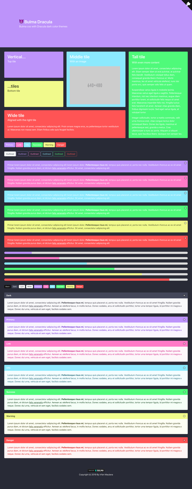

# 😈 bulma-dracula

 [](https://travis-ci.org/mazipan/bulma-dracula) [](https://www.npmjs.com/package/bulma-dracula)

> Bulma css with Dracula dark color themes

## Homepage

[https://mazipan.github.io/bulma-dracula/](https://mazipan.github.io/bulma-dracula/)

## Screenshoot



## Usage

Install dependency:

```bash
$ yarn add bulma-dracula
# OR
$ npm i bulma-dracula
```

Import in your `.scss` files:

```scss
@import "~bulma-dracula/src/bulma-dracula.scss";
```

CDN on `unpkg`:

[https://unpkg.com/bulma-dracula@1.0.0/dist/bulma-dracula.css](https://unpkg.com/bulma-dracula@1.0.0/dist/bulma-dracula.css)

Change `1.0.0` with latest version or you can just hit [https://unpkg.com/bulma-dracula](https://unpkg.com/bulma-dracula)

## Dracula Color Palette

This repo will override these variables https://bulma.io/documentation/customize/variables/ with below palletes:

Palette      | Hex       | RGB           | HSL             | 
---          | ---       | ---           | ---             | ---
Background   | `#282a36` | `40 42 54`    | `231° 15% 18%`  | 
Current Line | `#44475a` | `68 71 90`    | `232° 14% 31%`  | 
Selection    | `#44475a` | `68 71 90`    | `232° 14% 31%`  | 
Foreground   | `#f8f8f2` | `248 248 242` | `60° 30% 96%`   | 
Comment      | `#6272a4` | `98 114 164`  | `225° 27% 51%`  | 
Cyan         | `#8be9fd` | `139 233 253` | `191° 97% 77%`  | 
Green        | `#50fa7b` | `80 250 123`  | `135° 94% 65%`  | 
Orange       | `#ffb86c` | `255 184 108` | `31° 100% 71%`  | 
Pink         | `#ff79c6` | `255 121 198` | `326° 100% 74%` | 
Purple       | `#bd93f9` | `189 147 249` | `265° 89% 78%`  | 
Red          | `#ff5555` | `255 85 85`   | `0° 100% 67%`   | 
Yellow       | `#f1fa8c` | `241 250 140` | `65° 92% 76%`   | 

---

Copyright © 2019, Released under MIT license. By Irfan Maulana from 🇮🇩
